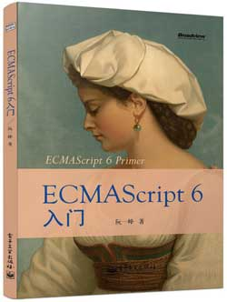

# ECMAScript 6入门

《ECMAScript 6入门》是一本开源的JavaScript语言教程，全面介绍ECMAScript 6新引入的语法特性。

本书力争覆盖ES6与ES5的所有不同之处，对涉及的语法知识给予详细介绍，并给出大量简洁易懂的示例代码。

本书为中级难度，适合已有一定JavaScript语言基础的读者，用来了解这门语言的最新发展；也可当作参考手册，查寻新增的语法点。

全书已由电子工业出版社出版（[版权页](images/copyright.png)，[内页1](images/page1.png)，[内页2](images/page2.png)），铜版纸全彩印刷，附有索引。电子版与纸版完全一致，如果您对本书感兴趣，建议考虑购买纸版。这样可以使出版社不因出版开源书籍而亏钱，进而鼓励更多的作者开源自己的书籍。

- [京东](http://item.jd.com/11526272.html)
- [当当](http://product.dangdang.com/23546442.html)
- [亚马逊](http://www.amazon.cn/%E5%9B%BE%E4%B9%A6/dp/B00MQKRLD6/)
- [China-pub](http://product.china-pub.com/4284817)

### 版权许可

本书采用“保持署名—非商用”创意共享4.0许可证。

只要保持原作者署名和非商用，您可以自由地阅读、分享、修改本书。

详细的法律条文请参见[创意共享](http://creativecommons.org/licenses/by-nc/4.0/)网站。
