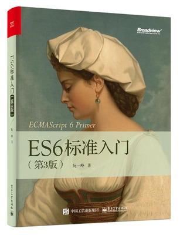

# ECMAScript 6 入门

《ECMAScript 6 入门》是一本开源的 JavaScript 语言教程，全面介绍 ECMAScript 6 新引入的语法特性。

本书覆盖 ES6 与上一个版本 ES5 的所有不同之处，对涉及的语法知识给予详细介绍，并给出大量简洁易懂的示例代码。

本书为中级难度，适合已经掌握 ES5 的读者，用来了解这门语言的最新发展；也可当作参考手册，查寻新增的语法点。如果你是 JavaScript 语言的初学者，建议先学完[《JavaScript 语言入门教程》](https://wangdoc.com/javascript/)，再来看本书。

全书已由电子工业出版社出版，2017年9月推出了第三版，书名为《ES6 标准入门》。纸版是基于网站内容排版印刷的。

感谢张春雨编辑支持我将全书开源的做法。如果您认可这本书，建议购买纸版。这样可以使出版社不因出版开源书籍而亏钱，进而鼓励更多的作者开源自己的书籍。下面是第三版的购买地址。

- [京东](https://search.jd.com/Search?keyword=ES6%E6%A0%87%E5%87%86%E5%85%A5%E9%97%A8%20%E7%AC%AC3%E7%89%88&enc=utf-8&wq=ES6%E6%A0%87%E5%87%86%E5%85%A5%E9%97%A8%20%E7%AC%AC3%E7%89%88)
- [当当](http://product.dangdang.com/25156888.html)
- [亚马逊](https://www.amazon.cn/ES6%E6%A0%87%E5%87%86%E5%85%A5%E9%97%A8-%E9%98%AE%E4%B8%80%E5%B3%B0/dp/B0755547ZZ)

### 版权许可

本书采用“保持署名—非商用”创意共享4.0许可证。

只要保持原作者署名和非商用，您可以自由地阅读、分享、修改本书。

详细的法律条文请参见[创意共享](http://creativecommons.org/licenses/by-nc/4.0/)网站。
